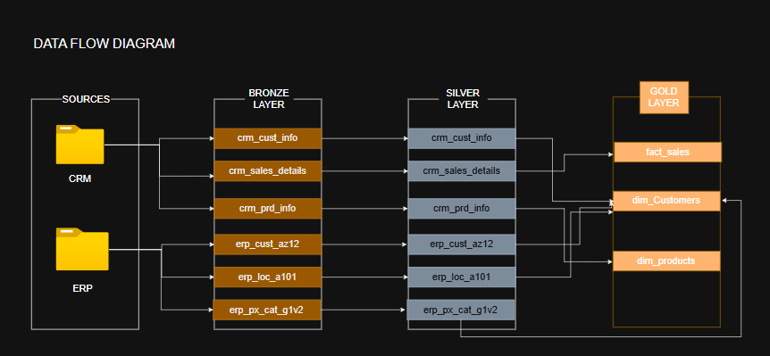
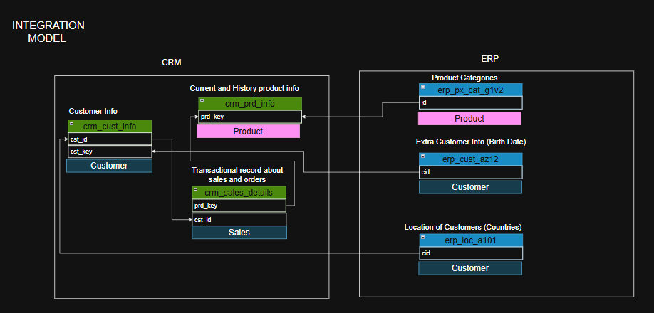
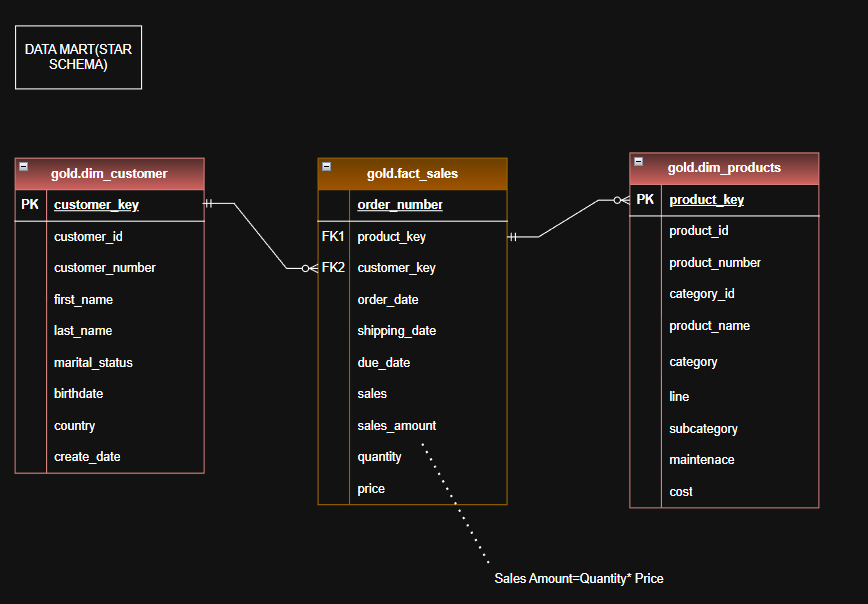

# SQL Data Warehouse Project

A SQL-based Data Warehouse project built using a layered Medallion Architecture (Bronze, Silver, and Gold layers).  
The project integrates data from CRM and ERP systems, processes and standardizes the datasets, and creates analytical models using a Star Schema design for reporting and business analysis.

---

# Architecture Overview

The warehouse follows a three-layer architecture:

## Bronze Layer
Stores raw data ingested directly from source systems.

### Source Systems
- CRM
- ERP

### Tables
- `crm_cust_info`
- `crm_sales_details`
- `crm_prd_info`
- `erp_cust_az12`
- `erp_loc_a101`
- `erp_px_cat_g1v2`

---

## Silver Layer
Contains cleaned and transformed data.

### Operations Performed
- Data cleansing
- Standardization
- Duplicate handling
- Data validation
- Data integration

This layer acts as the processed enterprise data layer before analytics modeling.

---

## Gold Layer
Contains business-ready analytical models designed using a Star Schema.

### Fact Table
- `fact_sales`

### Dimension Tables
- `dim_customers`
- `dim_products`

The Gold Layer is optimized for analytical queries and reporting.

---

# Data Flow Diagram



---

# Integration Model

The following diagram shows how CRM and ERP datasets are integrated before loading into the warehouse.



---

# Star Schema (Data Mart)

The final warehouse model follows a Star Schema design.



---

# Gold Layer Schema

## `gold.dim_customers`

| Column Name | Description |
|---|---|
| customer_key | Primary Key |
| customer_id | Customer identifier |
| customer_number | Customer number |
| first_name | Customer first name |
| last_name | Customer last name |
| marital_status | Marital status |
| birthdate | Customer birthdate |
| country | Customer country |
| create_date | Record creation date |

---

## `gold.dim_products`

| Column Name | Description |
|---|---|
| product_key | Primary Key |
| product_id | Product identifier |
| product_number | Product number |
| category_id | Category identifier |
| product_name | Product name |
| category | Product category |
| line | Product line |
| subcategory | Product subcategory |
| maintenance | Maintenance information |
| cost | Product cost |

---

## `gold.fact_sales`

| Column Name | Description |
|---|---|
| order_number | Order identifier |
| product_key | Foreign Key to products |
| customer_key | Foreign Key to customers |
| order_date | Order date |
| shipping_date | Shipping date |
| due_date | Due date |
| sales | Sales metric |
| sales_amount | Total sales amount |
| quantity | Quantity sold |
| price | Product price |

### Sales Amount Formula

```sql
sales_amount = quantity * price
```

---

# Technologies Used

- SQL
- Data Warehousing
- ETL Processing
- Star Schema Modeling
- Relational Databases

---

# Key Concepts Demonstrated

- Medallion Architecture
- Data Integration
- Data Transformation
- Fact and Dimension Modeling
- Star Schema Design
- Analytical Data Modeling
